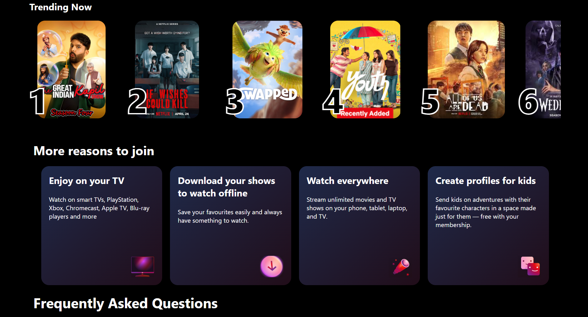

# Netflix Clone 

A responsive Netflix landing page clone built using HTML and CSS.

##  Live Features

- Responsive design for mobile, tablet, and desktop
- Hero section with Netflix-style background
- Trending movies horizontal scroll section
- Hover effects on movie cards
- "More reasons to join" feature cards
- FAQ section with Netflix-style layout
- Footer with responsive grid layout
- Floating label email input field
- Smooth UI styling and transitions

---

##  Technologies Used

- HTML5
- CSS3
- Flexbox
- CSS Grid
- Media Queries

---

##  Responsive Design

This project is fully responsive and works on:

- Desktop 
- Tablet 
- Mobile 

---

##  What I Learned

While building this project, I learned:

- Flexbox layouts
- CSS Grid
- Responsive web design
- Positioning in CSS
- Overflow scrolling
- Hover effects and transitions
- Media queries
- UI structuring
- Debugging frontend layouts

---

### Screenshots

Home Page

 Trending Section

Mobile Responsive View

##  Future Improvements

- Add JavaScript functionality
- Functional FAQ accordion
- Auto-scrolling carousel
- Dark/light theme toggle
- Backend integration

---

##  Project Structure
'''text
Netflix-Clone/
│
├── index.html
├── style.css
├── README.md
│
├── assets
│   
│__Output
│ 
│
'''
